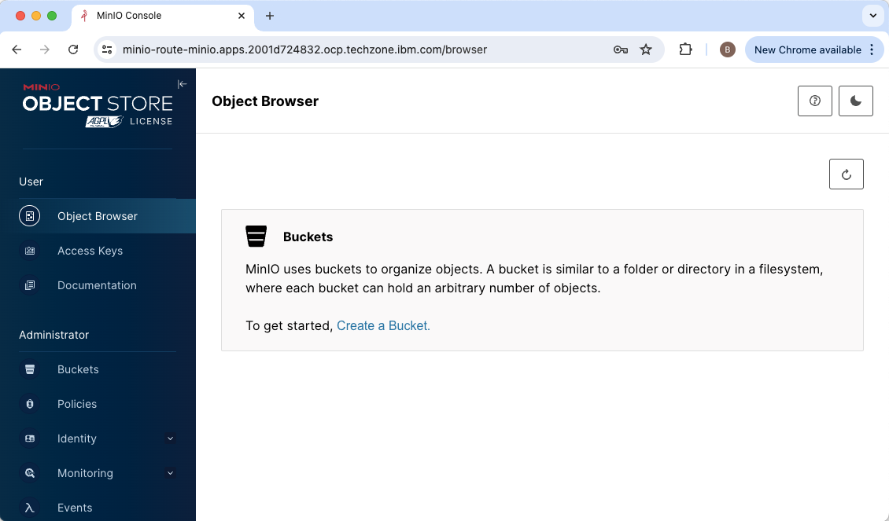
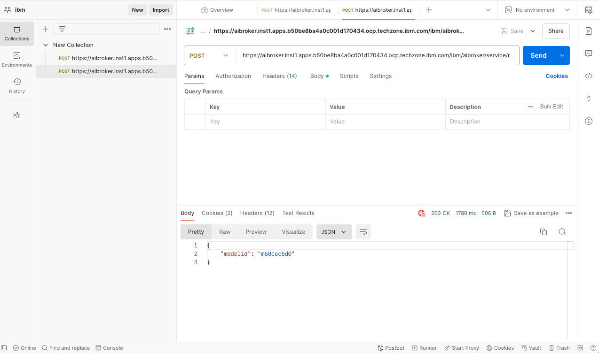
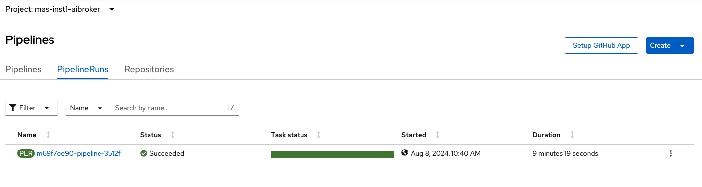
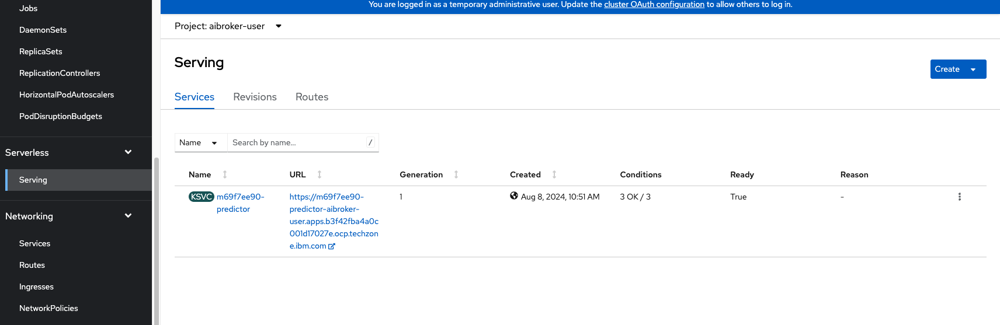
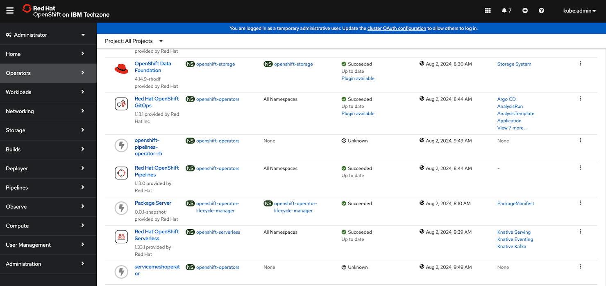
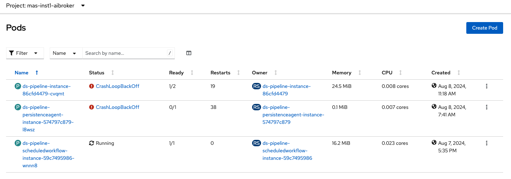

# Deploy IBM Maximo AI Broker

Maximo Application Suite (MAS) version 9.0 introduces a new feature, AI Broker. It is the integration hub that facilitates communication between MAS and IBM watsonx AI systems or services. For more details, check [Maximo Manage AI overview](https://www.ibm.com/docs/en/mas-cd/maximo-manage/continuous-delivery?topic=watsonx-maximo-manage-ai-overview).

You can install after Mas Core or Mas Manage is deployed. This document outlines steps for deploying Maximo AI broker and some troubleshooting tips.

Check [Installing and deploying the AI broker](https://www.ibm.com/docs/en/mas-cd/maximo-manage/continuous-delivery?topic=setup-installing-deploying-ai-broker)

Check [Install AI Broker Application](https://ibm-mas.github.io/ansible-devops/playbooks/oneclick-aibroker/#prerequisites_3), including prerequisites.

For IBM internal only, check the [video on how to install AI broker](https://ibm.ent.box.com/file/1560875310399) and the [PowerPoint file](https://ibm.ent.box.com/file/1559413953086?s=2gevj2hurz48je3v6j9sm2kopg4xrur8&tc=collab-file-invite-treatment).

## Prepare your installation environment

You can use your local environment with python3 and other dependencies, or use the container. In the example, a local folder `masconfig` is used and mapped to in the container. 

Check that you have "oneclick_add_aibroker.yml` available in the folder, e.g. `/Users/xxx/masconfig/ansible-devops/ibm/mas_devops/playbooks`

```
cd masconfig
docker run -it --rm --pull always -v ${PWD}:/masconfig --name ibmmas quay.io/ibmmas/cli
```

Clone the repo because you will need several files for the deployment.

## Create Minio storage

While you may be able to use IBM Cloud Object Storage and other S3 compatible storage systems, keep in mind that only two storage options, Minio or AWS S3 storage, have been tested at the time of this writing. Check more details on [how to install minio](https://min.io/docs/minio/kubernetes/openshift/operations/installation.html)

Ensure that you have downloaded the three yaml files, `kustomization.yml`,`minio.yml`,`pvc.yml`, and save them to the minio folder. Navigate to the parent folder and run the command lines below to create the Minio storage in its own namespace, `minio`, which is created automatically. 

```
#oc new-project minio
#cd ..
oc apply -k minio
```

You can find the url from the networking routes, e.g. `https://minio-route-minio.apps.xxx.com`,  and login with the default credentials, with username `minio123` and password `minio123`



## Create MariaDB and secret

MariaDB is required for AI Broker. Ensure that you have downloaded the yaml files in the repo, and save them to the mariadb folder. 

Open the mariadb network policy file, mariadb-np.yml, and update two values with the correct namespace, e.g. "kubernetes.io/metadata.name: mas-inst1-aibroker".

Navigate to the parent folder and run the command lines below to create a MariaDB database in its own namespace, `mariadb`, which is created automatically.


```
# oc new-project mas-inst1-aibroker
#cd ..
./mariadb/mariadb-deploy.sh
```

## Define environment variables

Depending on where you pull the container images, you will need define the following environment variables. Note that dev images are used currently so use the provided ARTIFACTORY credentials. 

```
# ARTIFACTORY credentials
export ARTIFACTORY_USERNAME="xxx"
export ARTIFACTORY_TOKEN="xxx"
export MAS_ICR_CP="docker-na-public.artifactory.swg-devops.com/wiotp-docker-local"
export MAS_ICR_CPOPEN="docker-na-public.artifactory.swg-devops.com/wiotp-docker-local/cpopen"

#MAS
export MAS_INSTANCE_ID="inst1"
export MAS_ENTITLEMENT_USERNAME="xxx"
export MAS_ENTITLEMENT_KEY="xxx"

# MINIO
export MAS_AIBROKER_STORAGE_ACCESSKEY="minio123"
export MAS_AIBROKER_STORAGE_SECRETKEY="minio123"
export MAS_AIBROKER_STORAGE_SSL="false"
export MAS_AIBROKER_STORAGE_PROVIDER="minio"
export MAS_AIBROKER_STORAGE_PORT="9000"
export MAS_AIBROKER_STORAGE_HOST="minio-service.minio.svc.cluster.local"
export MAS_AIBROKER_STORAGE_PIPELINES_BUCKET="km-pipelines"
export MAS_AIBROKER_STORAGE_TENANTS_BUCKET="km-tenants"
export MAS_AIBROKER_STORAGE_TEMPLATES_BUCKET="km-templates"

# WATSONX AI
export MAS_AIBROKER_WATSONXAI_APIKEY="xxx"
export MAS_AIBROKER_WATSONXAI_URL="https://us-south.ml.cloud.ibm.com"
export MAS_AIBROKER_WATSONXAI_PROJECT_ID="xxx"
export MAS_AIBROKER_CHANNEL="9.0.x"

# database
export MAS_AIBROKER_DB_HOST="mariadb-instance.mariadb.svc.cluster.local"
export MAS_AIBROKER_DB_PORT="3306"
export MAS_AIBROKER_DB_USER="mariadb"
export MAS_AIBROKER_DB_DATABASE="kmpipeline"
export MAS_AIBROKER_DB_SECRET_NAME="ds-pipeline-db-instance"
export MAS_AIBROKER_DB_SECRET_VALUE="mariadb"
```

## Install AI broker

Run the command line to install Maximo AI broker

```
#ansible-playbook playbooks/oneclick_add_aibroker.yml

ansible-playbook ibm.mas_devops.oneclick_add_aibroker
```

You can see the screen [output](docs/masaibroker_output.txt) from the ai broker deloyment. 

## Testing AI broker

After AI broker deployment, check to ensure all pods are running or completed without errors in the "mas-<instance>-aibroker" namespace.

You can test the AI broker service using tools like the terminal session, Visual Studio Code with Rest Client or Postman.

### Run the curl command lines

Before running the test, obtain the following information and replace them in the curl command lines.

- ai broker url. It's available from networking routes in the `mas-<instance name>-aibroker` namespace.
- api key. It is available from the secret of `aibroker-user----apikey-secret` in the `mas-<instance name>-aibroker` namespace.
- The [working.zip](docs/working.zip) file from the repo. 

Send over the working.zip file
```
curl --location --request POST 'https://aibroker.inst1.apps.xxx.com/ibm/aibroker/service/rest/api/v1/uploadfile?filename=working.zip' \
--header 'apikey: xxx' \
--header 'tenantid: aibroker-user' \
--header 'modelid;' \
--header 'Content-Type: application/zip' \
--header 'Cookie: 4c47ff0e86b47bc367679e589d646347=76943252df0d580a4cd4a8651a70c823; JSESSIONID=0000q8h9d2eUFqD7xWt1gR8eheF:860d418d-de7d-43b4-83c4-69a3e605bc61' \
--data-binary '@/Users/xxx/Downloads/working.zip'
```

Get the model id
```
curl --location --request POST 'https://aibroker.inst1.apps.xxx.com
--header 'apikey: xxx' \
--header 'tenantid: aibroker-user' \
--header 'dataid: working.zip' \
--header 'Content-Type: application/json' \
--header 'Cookie: 4c47ff0e86b47bc367679e589d646347=76943252df0d580a4cd4a8651a70c823; JSESSIONID=0000NXBS_3cnUJ8PQMBL7iom6Nw:860d418d-de7d-43b4-83c4-69a3e605bc61' \
--data-raw '{
  "arguments": {

      "keyname":"workorderid",
      "score_threshold":0.1,
      "target":"problemcode",
      "target_description":"problemcode_description"
  },
  "template":{
       "id":"pcc",
       "templateversion":"1.0.0.test"
     }
}'
```

If the curl command lines failed due to SSL certificate problem, add -k or --insecure to allow insecure server connections. 

You can import to Postman and run there.



If no errors occurred, you can check the pipeline runs in OpenShift.



You can open the url from Serverless | serving in the aibroker-user namespace, and see the msg, `{"status":"alive"}`.



### Test inference using VS Code

In VS Code with Rest Client extension, create a file named [aibroker test.http](docs/aibroker%20test.http). Replace the variables with values you find previously, including the model id from the second curl command line. Note: You can do similar test in Postman.

```
### REST Client
@aibrokerurl =https://aibroker.inst1.apps.xxx.com/ibm/aibroker/service/rest/api/v1/model/{{modelid}}/infer/predict
@tenantid =aibroker-user
@apikey =sCRr4873RdNr0gXoaH4AZz60IcXJeYqV
@modelid=mc4210860

POST {{aibrokerurl}}
apikey: {{apikey}}
tenantid: {{tenantid}}
Content-Type: application/json

{
    "instances": [
        {
            "description": "Engine start problem",
            "workorderid": 133438
        }  
    ]
}
```

Here is the response you may get.

```
HTTP/1.1 200 OK
content-type: application/json
x-content-type-options: nosniff
x-xss-protection: 0
cache-control: no-cache, no-store, max-age=0, must-revalidate
pragma: no-cache
expires: 0
strict-transport-security: max-age=31536000 ; includeSubDomains
x-frame-options: DENY
content-language: en-US
set-cookie: JSESSIONID=0000U5PfmA2aqlxc5NcfIXEStIo:9342ed1c-9ed0-41f5-b3ba-6014f8d2adb5; Path=/; HttpOnly
transfer-encoding: chunked
date: Thu, 08 Aug 2024 16:20:45 GMT
connection: close

{
  "predictions": [
    [
      {
        "confidence": 48,
        "value": "PDE",
        "recommended": false
      },
      {
        "confidence": 43,
        "value": "PTF",
        "recommended": false
      },
      {
        "confidence": 43,
        "value": "STD",
        "recommended": false
      }
    ]
  ]
}
```

## Delete MAS AI Broker

To delete MAS AI Broker, the easiest way is to delete its namespace and the `aibroker-user` namespace. You may also delete the Minio storage and MariaDB database. Unlike other MAS app deployment, no custom resources for AI Broker deployment are created so no additional cleanup is necessary.

## Troubleshoot issues

### MariaDB pod shows pending status

The issue may be related to PVC. The storage class, `ocs-storagecluster-cephfs` is used in the `mariadb-pvc.yml` file. Change it to the storage class, e.g. "ibmc-block-gold".

```
---
apiVersion: v1
kind: PersistentVolumeClaim
metadata:
  name: mariadb-pvc
  namespace: mariadb
  labels:
    app: mariadb-instance
    component: data-science-pipelines
spec:
  accessModes:
    - ReadWriteOnce
  storageClassName: ibmc-block-gold
  resources:
    requests:
      storage: 20Gi
```

### Role `ibm.mas_devops.odh` is not found

You may run into the error that looks like this.

```
The error appears to be in '/Users/xxx/masconfig/ansible-devops/ibm/mas_devops/playbooks/oneclick_add_aibroker.yml': line 47, column 7, but may
be elsewhere in the file depending on the exact syntax problem.

The offending line appears to be:

  roles:
    - ibm.mas_devops.odh
      ^ here
```

It is likely that your ansible-galaxy collection for "ibm mas devops" is dated. Run the command lines below.

```
ansible-galaxy collection build 
ansible-galaxy collection install ibm-mas_devops-*.tar.gz --ignore-certs --force
```

### ServiceMesh CRD waiting but not finished

If you find the task `Wait until the ServiceMesh CRD is available` is not finished, it is likely that there is some issue with the service mesh operator.

```
TASK [ibm.mas_devops.odh : Wait until the ServiceMesh CRD is available] ********************************************************************************************
included: /opt/app-root/lib64/python3.9/site-packages/ansible_collections/ibm/mas_devops/common_tasks/wait_for_crd.yml for localhost
TASK [ibm.mas_devops.odh : wait_for_crd : Wait until the servicemeshcontrolplanes.maistra.io CRD is available] *****************************************************
FAILED - RETRYING: [localhost]: wait_for_crd : Wait until the servicemeshcontrolplanes.maistra.io CRD is available (60 retries left).
FAILED - RETRYING: [localhost]: wait_for_crd : Wait until the servicemeshcontrolplanes.maistra.io CRD is available (59 retries left).
```

You can delete the "openshift-pipelines-operator-rh" operator.



### DSCInitialization error

The task `Create DSCInitialization instance` may fail due to internal server error.

```
TASK [ibm.mas_devops.odh : Create DSCInitialization instance] ******************************************************************************************************
fatal: [localhost]: FAILED! => changed=false 
  error: 500
  msg: 'DSCInitialization default-dsci: Failed to apply object: b''{"kind":"Status","apiVersion":"v1","metadata":{},"status":"Failure","message":"Internal error occurred: failed calling webhook \\"operator.opendatahub.io\\": failed to call webhook: Post \\"https://opendatahub-operator-controller-manager-service.openshift-operators.svc:443/validate-opendatahub-io-v1?timeout=10s\\": dial tcp 10.131.0.30:9443: connect: connection refused","reason":"InternalError","details":{"causes":[{"message":"failed calling webhook \\"operator.opendatahub.io\\": failed to call webhook: Post \\"https://opendatahub-operator-controller-manager-service.openshift-operators.svc:443/validate-opendatahub-io-v1?timeout=10s\\": dial tcp 10.131.0.30:9443: connect: connection refused"}]},"code":500}\n'''
  reason: Internal Server Error
  status: 500
```

### Pods with "CrashLoopBackOff" errors

If ds-pipeline-instance and/or ds-pipeline-persistenceagent-instance pods keep crashing with "CrashLoopBackOff" errors, check the following.



- mariadb instance is working properly
- data science cluster, including DSC initialization and Feature Tracker, in the open data hub operator is running properly

Address any issues you find, and re-run the ai broker playbooks. 

### Manual certificate management issue 

You may get an error like, 
```
Manual certificate management is enabled and the required TLS secret `inst1-public-aibroker-tls` has not been created in namespace ''mas-inst1-aibroker'''
```

When custom certificates are used for MAS, it is likely that manual certificate management is set to true in OpenShift. To resolve the issue, create a secret for `inst1-public-aibroker-tls` in OpenShift by copying the certificates and keys in the MAS Core namespace. You can also check what certificates are used from the MAS admin portal, and create it there. Re-run the ai broker playbooks.

```
kind: Secret
apiVersion: v1
<!-- metadata: -->
  name: inst1-public-aibroker-tls
  namespace: mas-inst1-aibroker
...
data:
  ca.crt: xxx
  tls.crt: xxx
  tls.key: xxx
type: kubernetes.io/tls
```

## Acknowledgement

Many thanks to the product group, Kewei Yang, Eyal Cohen, Rafael Felipe Craveiro Teixeira and Roshi Dubey for sharing their knowledge and troubleshooting tips. Also, thanks to Janki Vora and Veera Solasa for their collaboration and feedback.
